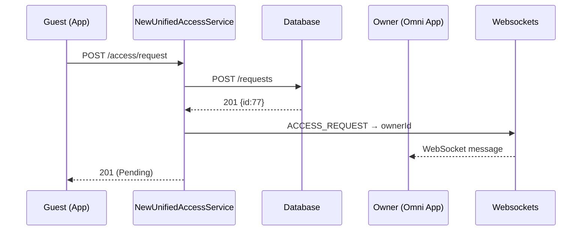
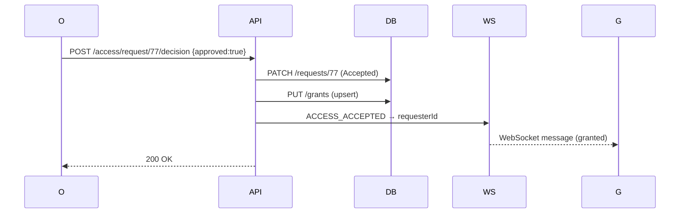
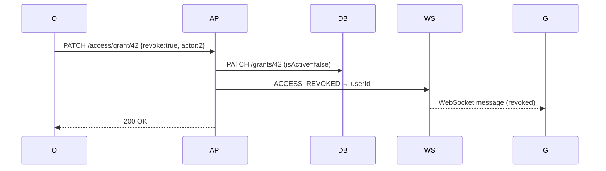

# UnifiedAccessService – Design Proposal

## Purpose

Provide a **single service** that controls every access workflow (request → approve/decline → update → revoke) for any shareable resource that we may have on hayward.
Current resources: **Site**, **MSP**. Future‑ready for any other resource wtih minimal changes.

## Key Decisions (framework‑agnostic)

| # | Decision                                                       | Thinking                                                                                     |
| - | -------------------------------------------------------------- | -------------------------------------------------------------------------------------------- |
| 1 | **`TargetType` enum** (`SITE`, `MSP`, …)                       | Adding a new shareable resource requires only an enum extension, not a schema change.        |
| 2 | **Two tables only**: `access_grant` & `access_request`         | Consolidates four legacy tables into two                                                     | 
| 3 | **supports WebSocket events for any of the resources**         | UI receives live updates without polling.                                                    |

## Payload examples 

```jsonc
// access_grant
{
  "id": 42,
  "targetType": "SITE",           // TargetType
  "targetId": 17,
  "userId": 9,
  "accessLevel": "FULL_TIME_GUEST", // AccessLevel
  "isActive": true,
  "expiresAt": null,
  "createdAt": "2025-06-04T12:00:00Z",
  "updatedAt": "2025-06-04T12:00:00Z"
}

// access_request
{
  "id": 77,
  "targetType": "MSP",
  "targetId": 3,
  "requester": 14,
  "requesterEmail": "guest@foo.com",
  "requestee": 2,                     // Owner 
  "requesteeEmail": "owner@bar.com",
  "requestedLevel": "FULL_TIME_GUEST",
  "status": "PENDING",              // RequestStatus
  "createdAt": "2025-06-04T12:05:00Z"
}
```


## Types Definitions

```ts
export enum TargetType {
  SITE = 'SITE',
  MSP  = 'MSP',
}

export enum AccessLevel {
  Owner           = 'OWNER',            
  FullTimeGuest   = 'FULL_TIME_GUEST', 
  TempGuest       = 'TEMP_GUEST',      
}

export enum RequestStatus {
  Pending  = 'PENDING',
  Accepted = 'ACCEPTED',
  Rejected = 'REJECTED',
}

export enum RequestType {
  AccessRequest  = 'ACCESS_REQUEST',
  AccessAccepted = 'ACCESS_ACCEPTED',
  AccessDeclined = 'ACCESS_DECLINED',
  AccessUpdated  = 'ACCESS_UPDATED',
  AccessRevoked  = 'ACCESS_REVOKED',
}

```


## API Endpoints

| Method & Path                           | Body                                                                  | Purpose                                             |
| --------------------------------------- | --------------------------------------------------------------------- | --------------------------------------------------- |
| **POST** `/access/request`              | `{ targetType, targetId, requester, requesterEmail, requestedLevel }` | Guest submits access request.                       |
| **POST** `/access/request/:id/decision` | `{ approved: Boolean, ownerId }`                                      | Owner approves or declines request.                 |
| **PATCH** `/access/grant/:id`           | `{ actor, revoke?, level? }`                                          | Owner changes level or revokes grant.               |

## Sequence Diagrams (mermaid)

### Guest Request flow



### Approval flow


### Revoke Flow 



